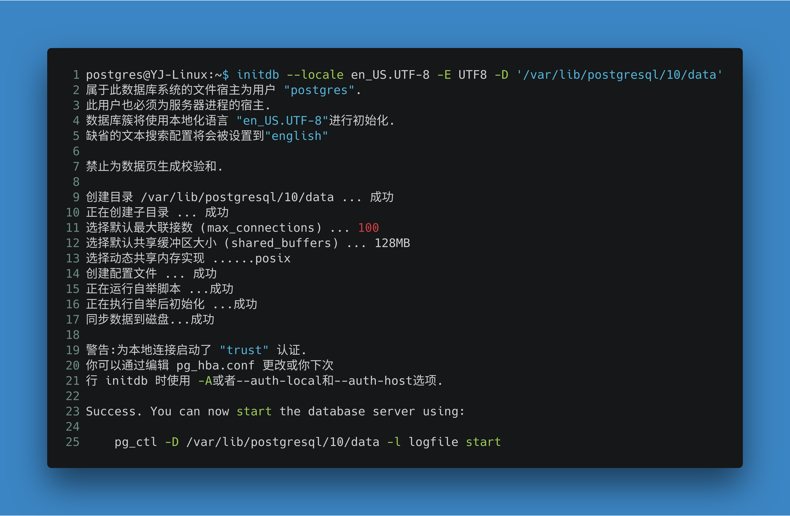
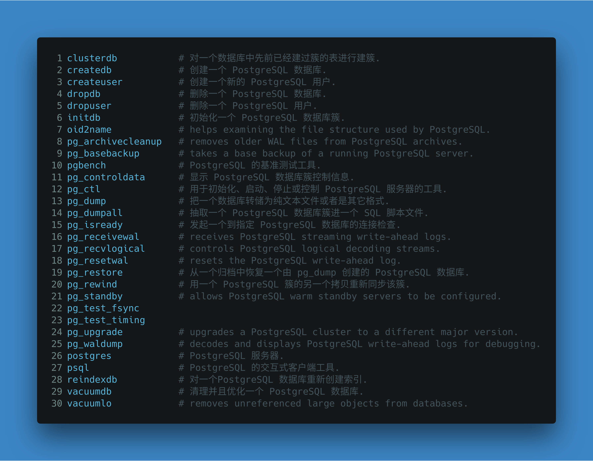
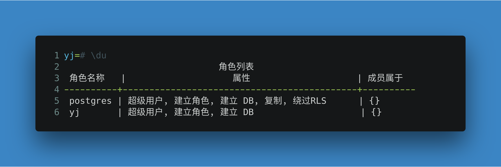

# PostgreSQL安装配置

---

[wikipedia](https://en.wikipedia.org/wiki/PostgreSQL)

[PostgreSQL](https://www.postgresql.org/) ：**对象-关系型**数据库管理系统，发行在BSD许可，开源，社区驱动，兼容标准的对象-关系数据库系统

---

---

**[参考]**：

1. [ArchWiki](https://wiki.archlinux.org/index.php/PostgreSQL)
2. [PostgreSQL中文社区](http://www.postgres.cn)

---

## 安装

```bash
# pacman -S postgresql
```

---

## 配置

- 默认端口：5432

### 主要配置

#### 1. 设置密码

> postgresql安装完成之后会自动创建一个空密码的名为*postgres*的系统用户


#### 2. 切换到postgres用户

- 如果当前用户在sudoers并且安装了sudo：

  

- 否则：

  

#### 3. 初始化一个数据库簇

> 数据库簇 (database cluster)：即数据库存储区域，SQL标准使用的术语是**目录簇**
>
> 在文件系统术语中，一个数据库簇是一个单一目录，所有数据都将被存储在其中，称为**数据目录**或**数据区域**
>
> 一个数据库簇是被一个数据库服务器的单一实例所管理的多个数据库的集合
>
> 初始化后一个数据库簇将包含一个名为`postgres`的默认数据库，数据库服务器本身并不要求其存在
>
> 另一个在初始化过程中为每一个簇创建的数据库是`template1，`顾名思义，它将被用于创建后续数据库的模板，并不用于实际工作

- 簇的位置是可选的，类似于`/usr/local/pgsql/data`或`/var/lib/postgres/data`的位置比较流行
- 簇的语言环境(locale)和编码(encoding)默认是从当前系统环境的`$LANG`变量派生的，建议如图进行配置



如果运行命令的输出如图（或者是对应的英文输出，取决于你的系统语言环境）全部是“成功”（或者"ok"），代表数据库簇初始化成功

***之后使用`systemctl`启动PostgreSQL并设置自启动***

#### 4. 创建用户+数据库

> 如果创建一个与用户($USER)同名的数据库用户，并允许其访问 PostgreSQL 数据库的 shell，那么在使用PostgreSQL 数据库 shell 的时候无需指定用户登录，这样做会比较方便

- 创建用户

  

  用户创建完成之后执行`exit`退出`postgres`

- 创建数据库

  如果数据库用户名和登录shell用户名一致，执行：

  

  如果数据库用户名和登录shell用户名不一致，则执行：

  

### 可选配置

访问[PgTune](https://pgtune.leopard.in.ua)生成适合指定机器的配置选项

> 使用`psql`连接到PostgreSQL，执行`show configure_file;`查看使用的配置文件：
>
> 
>
> `postgresql.conf`中指定数据库簇和其他相关配置文件的路径：
>
> 

#### 身份认证配置文件`pg_hba.conf`

默认允许任何本地用户连接任何数据库用户，包括超级用户

将：


修改为：


以只允许`progres`身份使用超级用户权限（**按需修改**）

#### 主配置文件`postgresql.conf`

- 允许远程访问POstgreSQL

  修改 *CONNECTIONS AND AUTHENTICATION* 部分：

  

  然后在`pg_hba.conf`中的 *IPv4 local connections* 添加：

  

- 只允许UNIX Sockets访问

  > 这将完全禁用网络侦听

  修改 *CONNECTIONS AND AUTHENTICATION* 部分：

  

- 空闲时防止磁盘写入

  > PostgreSQL定期更新内部的 "statistics" 文件，该文件默认存储在硬盘上，因此会导致频繁的磁盘旋转并产生噪音，将该文件存储到**memory-only**文件系统可以避免这种情况

  按照如下所示修改`postgresql.conf`文件：

  

---

## 使用

> PostgreSQL安装完成后可使用的工具：
>
> 

### 1. 连接数据库shell

使用`psql`连接到数据库shell

> 连接到shell后可以创建数据库或表、设计权限和运行原始的SQL命令


- 帮助信息

  

- 连接到指定数据库

  

- 列出所用用户及其权限

  

- 列出当前数据库所有表的汇总信息

  

- 查看所有元命令

  

- 退出psql

  

---

## 升级PostgreSQL

请遵循[官方升级文档](https://www.postgresql.org/docs/current/upgrading.html)
